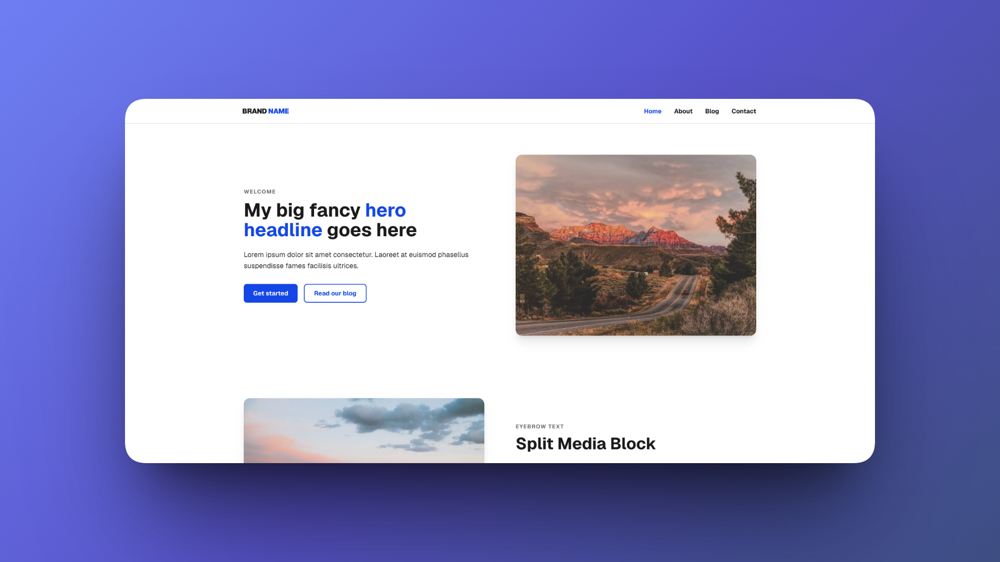

# Astro Starter
[](https://jaketarrdev-astro-starter.netlify.app/)

**Preview:** [jaketarrdev-astro-starter.netlify.app](https://jaketarrdev-astro-starter.netlify.app/)


[](https://app.netlify.com/projects/jaketarrdev-astro-starter/deploys)


A barebones, deliberately architected Astro starter with a component/pattern/block/global hierarchy modeled on CMS conventions, colocated CSS, MDX-driven page building, and optional Keystatic CMS integration.

## Philosophy

This isn't a typical Astro theme — it's an opinionated barebones starter built around a deliberate architectural philosophy. Every decision has a reason behind it, documented directly in the code as comments. For the reasoning behind the bigger structural choices, see [ARCHITECTURE.md](./ARCHITECTURE.md).

## Quick Start

```
git clone <repo-url>
cd astro-starter
npm install
npm run dev
```

Visit `http://localhost:4321`. Keystatic admin at `/keystatic`.

Update `src/consts.ts` with your site name, description, nav links, and
social links.

## Stack

- **Astro 7** — static-first, island architecture
- **Tailwind v4** — CSS-first config, no JS config file
- **Alpine.js** — lightweight interactivity (nav, table of contents, filters)
- **Keystatic** — optional git-based CMS with local/GitHub storage
- **MDX + Markdoc** — content authoring with component composition
- **TypeScript** — strict mode throughout

## Project Structure

```
src/
├── components/   # Building blocks — Button, Badge, Icon, Heading
├── patterns/     # Groups of components — BlogCard, Pagination, NavList
├── blocks/       # Page sections — Hero, SplitMedia, FeaturedPost
├── globals/      # Header, Footer, Head
├── layouts/      # Base, Page
├── content/      # Content collections (blog, pages, categories)
└── styles/       # Design tokens, global CSS
```

Components are the smallest reusable building blocks with no business logic. Patterns compose components into something usable (a card, a nav list). Blocks are full-width page sections built from components and patterns, meant to be dropped into MDX content and driven by frontmatter or CMS data — think Matrix fields in Craft CMS or WordPress ACF flexible content.

The starter ships with a handful of blocks (Hero, SplitMedia, FeaturedPost) to demonstrate the pattern. Add your own as needed.

## Content Authoring

- **Pages** (`src/content/pages/`) — MDX designed to work like a page
  builder: import blocks (`Hero`, `SplitMedia`) and compose them
  directly in content
- **Blog** (`src/content/blog/`) — one folder per post, colocated
  images and thumbnail managed through Keystatic's image field, body
  written in Markdoc or MDX

Each route in `src/pages/` fetches its matching content entry and
renders it. Static pages (`index.astro`, `about.astro`) fetch a single
entry from the `pages` collection. Blog posts use `getStaticPaths()`
to loop over the `blog` collection and generate one route per post.
Either way, the pattern is the same: fetch, `render()`, drop
`<Content />` into a layout.

```
// src/pages/index.astro
const home = await getEntry('pages', 'home');
const { Content } = await render(home);
---
<Page>
  <Content />
</Page>
```

## Design Tokens

Colors, spacing, type scale, breakpoints, and fonts all live in
`src/styles/tokens.css` as CSS variables inside Tailwind v4's `@theme`
block — [the standard way to define design tokens in v4](https://tailwindcss.com/docs/adding-custom-styles).

Rich text content (`src/components/rich-text/RichText.astro`) uses hand-written CSS rather than
`@tailwindcss/typography` or a prose plugin, so long-form content stays
on the same token system instead of introducing its own spacing scale.

## SEO

- Meta tags, canonical URLs, Open Graph, and Twitter cards handled in
  `src/globals/head/Head.astro`
- Per-page title/description via `<Page title="..." description="..." />`
  — titles auto-format as `"Page - Site Name"`; pages and blog posts can
  override via optional `seoTitle`/`seoDescription` frontmatter fields
- Blog posts get `og:type="article"` and `BlogPosting` JSON-LD structured
  data automatically
- `robots.txt` and `sitemap-index.xml` generated at build time via
  `@astrojs/sitemap`
- RSS feed at `/rss.xml` via `@astrojs/rss`
- Custom `404.astro`

## Optional: Removing Keystatic

Don't need a CMS? Remove it:

1. Delete `keystatic.config.ts`
2. Delete `src/pages/keystatic/` and `src/pages/api/keystatic/`
3. Remove the `keystatic` import and `keystatic()` entry from
   `astro.config.mjs`
4. `npm uninstall @keystatic/astro @keystatic/core`
5. Clear caches: `rm -rf .astro node_modules/.vite`

Your content in `src/content/` is unaffected — Keystatic is just the
editor, not a runtime dependency.

## Optional: Contact Form

Uses Astro Actions, which needs a server adapter (Netlify, Vercel, or
Node). Don't need a form? Remove `src/actions/` and
`src/pages/contact.astro`.

## Commands

| Command | Description |
|---|---|
| `npm install` | Installs dependencies |
| `npm run dev` | Starts local dev server at `localhost:4321` |
| `npm run build` | Build your production site to `./dist/` |
| `npm run preview` | Preview your production build via `netlify serve` |
| `npm run check-docs` | Verify component docblocks match their prop interfaces |
| `npm run check-docs -- --fix` | Auto-fix missing/misaligned docs |

## Performance

Built and tuned to a 100 Lighthouse performance score. See the
[Image Performance section](./ARCHITECTURE.md#image-performance) of
ARCHITECTURE.md for the optimization notes.

## Deployment

Configured for Netlify via `@astrojs/netlify`. Swap the adapter in
`astro.config.mjs` for Vercel or Node if deploying elsewhere.

## License

MIT